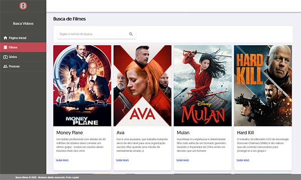

# Busca Filmes

Este repositório é um aplicativo em React sobre busca de Filmes, Séries e Atores.
O app consome The Movie Database API, disponível em https://developers.themoviedb.org/3/search/search-movies

### Crie uma conta e obtenha a API key

https://www.themoviedb.org/settings/api

### Demonstração



### Install

```sh
git clone https://github.com/lucianopopo/busca-filmes.git
cd busca-filmes
npm install
npm start
```

### Technology stack

- [x] React
- [x] Material-UI
- [x] Typescript
